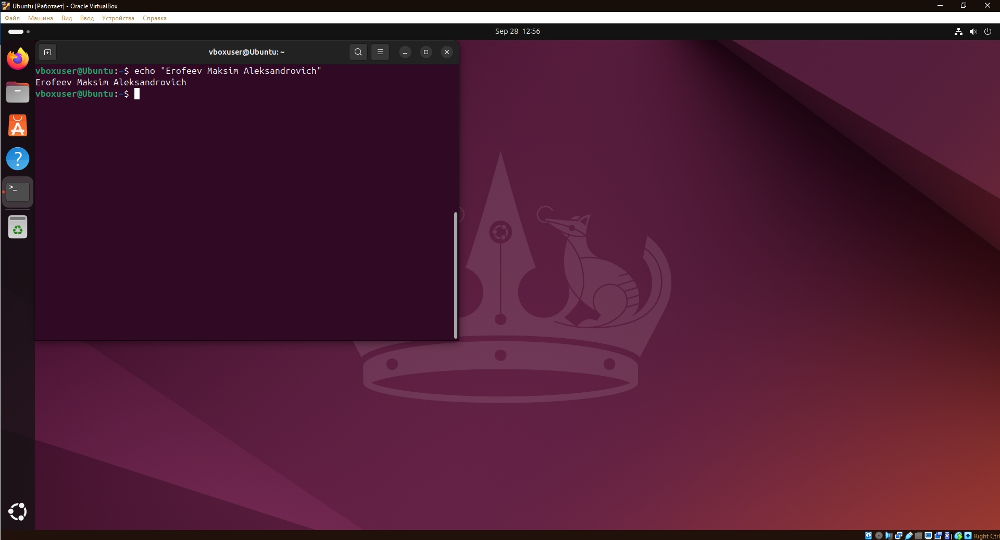
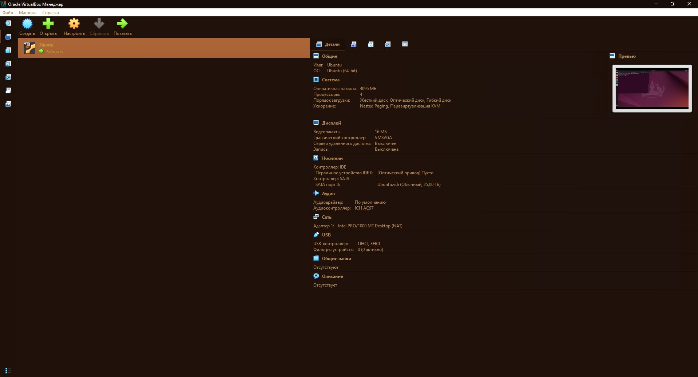
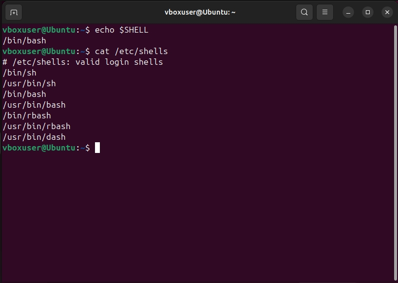
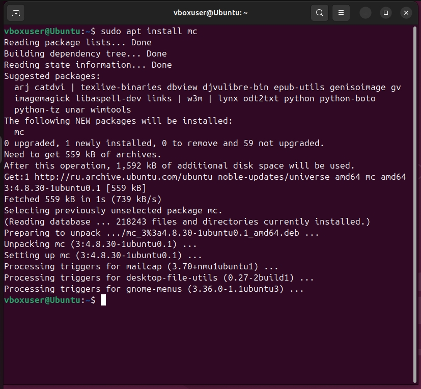
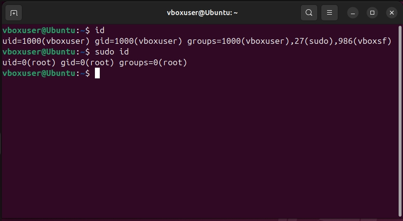

### Задание 1
Подготовьте рабочее пространство:
Скачайте с сайта VirtualBox и установите на свой компьютер
Создайте новую виртуальную машину
Скачайте Ubuntu
Установите Ubuntu на вашу виртуальную машину
Примечание: Если у вас операционная система macOS или Linux, воспользуйтесь инструкцией.
Сделайте скриншот консоли, где в строке ввода будет ваше ФИО.

### Задание 2
Запустите терминал и выполните команды:
echo $SHELL
cat /etc/shells
Ответ приведите в виде снимка экрана и прокомментируйте в свободной форме результаты выполнения указанных команд
Команда “echo” выводит текст или значения переменных в терминал.
echo $SHELL - показывает текущую командную оболочку пользователя.
Команда “cat” выводит содержимое файла в терминал.
cat /etc/shells - показывает все доступные командные оболочки в системе.

### Задание 3
Установите при помощи утилиты apt файловый менеджер mc.
Решение приведите в виде последовательности команд или снимка экрана

### Задание 4* (необязательно выполнение)
Его выполнение необязательное и не влияет на получение зачёта по домашнему заданию. Можете его решить, если хотите лучше разобраться в материале.
Выполните следующие команды:
id
sudo id
Объясните, почему вывод одной и той же команды отличается в этих случаях.
id показывает информацию о текущем пользователе
sudo id показывает информацию о пользователе Root

